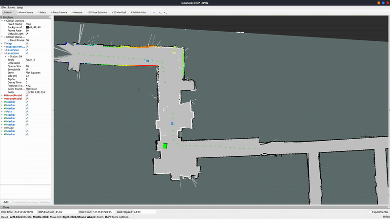
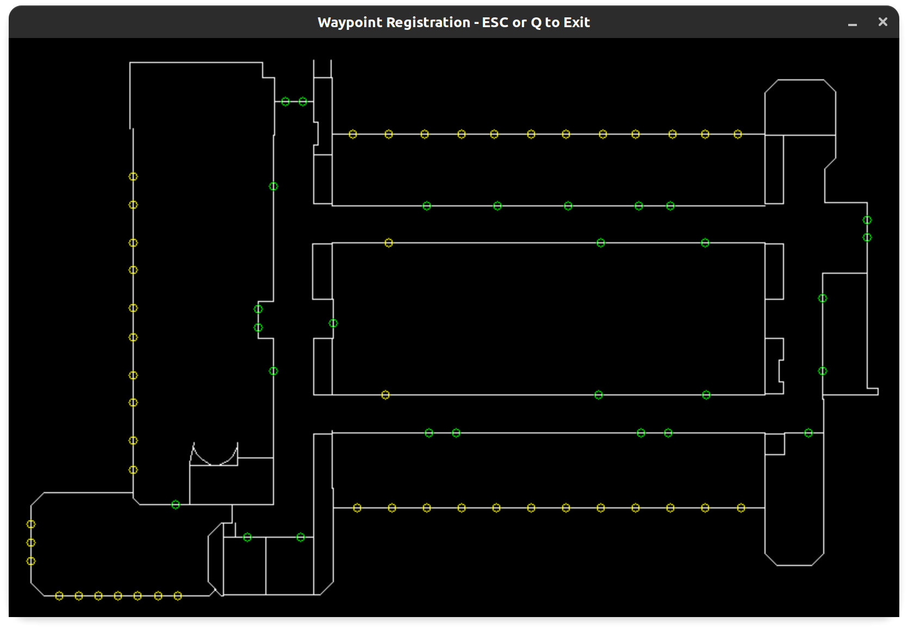

# CAD2CAV: Computer-Aided Design for Cooperative Autonomous Vehicles
This is the github project for the F1Tenth Independent Study Projects 2021. In this project we want to plan the paths for multi-agent given a prior of an environment like a blueprint of the building’s floor plan.




**For Developers: This repos has not set up CI tools. Please make sure `clang-format` is properly in use when contributing to the code base, in order to keep coding style consistent.**

## System Requirements
- Linux Ubuntu (tested on 20.04 LTS)
- ROS Noetic
- GCC 5+/Clang 5+ (support for C++17)

## Software Requirements
- Boost 1.71
- LibConfig++ 1.5.0
- Eigen 3.3.7
- [OpenCV 4.5.1](https://github.com/opencv/opencv/tree/4.5.1)
- [Google OR-Tools 9.0](https://github.com/google/or-tools/releases/tag/v9.0)
- [OSQP 0.6.2](https://github.com/oxfordcontrol/osqp/releases/tag/v0.6.2)
- [OSQP-Eigen 0.6.3](https://github.com/robotology/osqp-eigen/releases/tag/v0.6.3)
- [METIS 5.1.0](http://glaros.dtc.umn.edu/gkhome/metis/metis/overview)
- [ROS Integration for Cartographer SLAM](https://google-cartographer-ros.readthedocs.io/en/latest/)
- [Protocol Buffers (Protobuf) 3.17.3](https://github.com/protocolbuffers/protobuf/blob/master/src/README.md)
- [shineyruan/cad2cav_common](https://github.com/shineyruan/cad2cav_common)

(*Deprecated, contact author for update*) This project also depends on another UE4 software that provides initial landmark locations for the planner to plan. One should also have the following:
- [shineyruan/unreal_levine_4](https://github.com/shineyruan/unreal_levine_4)
- Autodesk Revit 2019
- Autodesk AutoCAD 2019
- Unreal Engine 4.23.1

This project also has an on-board part that is **only meant to be compiled on an F1TENTH vehicle**. To checkout the code, please refer to:
- [shineyruan/cad2cav_onboard](https://github.com/shineyruan/cad2cav_onboard)

First run and install the following packages from Ubuntu repository:
```bash
sudo apt install libconfig++-dev libboost-all-dev libmetis-dev google-mock libgmock-dev
```

Then install other dependencies (OpenCV, Google OR-Tools, OSQP, OSQP-Eigen, Protobuf) by building from source manually.

**NOTE. The `graph_partitioner` package provides 2 different ways of building Google OR-Tools. Please check out [this README](https://github.com/mlab-upenn/ISP2021-cad2cav/tree/main/graph_partitioner) for more details.**

## Installation
1. This repo serves as a collection of ROS packages and you can plug it directly into any Catkin workspaces.
```bash
mkdir -p ~/catkin_ws/src
cd ~/catkin_ws/src
catkin_init_workspace
git clone --recursive https://github.com/mlab-upenn/ISP2021-cad2cav.git
git clone --recursive https://github.com/shineyruan/cad2cav_common.git
cd ..
```

2. Please follow the [official documentation for Cartographer SLAM](https://google-cartographer-ros.readthedocs.io/en/latest/) to install the latest `cartographer_ros` package in the `src/` folder.

3. To build the project without pre-installing Google OR-Tools for graph partitioner (**which would probably take about 5 more minutes**), run
```bash
cd ~/catkin_ws
catkin_make_isolated --install --use-ninja -DBUILD_ORTOOLS=ON
source install_isolated/setup.bash
```
otherwise, if the versions of other software strictly matches the requirements above, one can also use the pre-built OR-Tools binaries in `graph_partitioner/3rdparty`:
```bash
cd ~/catkin_ws
catkin_make_isolated --install --use-ninja -DBUILD_ORTOOLS=OFF
source install_isolated/setup.bash
```

Note that this project contains multiple large repositories (Cartographer SLAM, Google OR-Tools) and it might take a considerable amount of time to build for the first time (**~7 minutes on Ryzen 7 3700X, ~17 mins on i7-8550U**). It is recommended to use [Ninja over Make](https://ninja-build.org/manual.html#_comparison_to_make) for faster compiling speed. `catkin_make_isolated` is also required for Cartographer SLAM as it contains non-ROS packaged subdirectories.

4. (*Deprecated*) Developers of this project should also have Unreal Engine 4.23.1 installed in the system. From this point onwards, we assume that your UE4 is cloned and installed in directory `${UE4_ROOT}`.
```bash
cd ~
git clone --recursive https://github.com/shineyruan/unreal_levine_4
```

One can check the installation of UE4 by trying to open the project in UE4 Editor:
```bash
cd ${UE4_ROOT}/Engine/Binaries/Linux
./UE4Editor ~/unreal_levine_4/Levine_4.uproject
```

5. To run the system on an F1TENTH car, one should make a Catkin workspace on the car and clone the following repo **on-board**:
```bash
mkdir -p ~/catkin_ws/src
cd ~/catkin_ws/src
catkin_init_workspace
git clone https://github.com/shineyruan/cad2cav_onboard.git
cd ..
catkin_make_isolated
```

## Running the code
### User Waypoint Registration
Users can click to specify planning waypoints by running the following application:
```bash
rosrun map_service waypoint_registration_node
```


### Coverage Sequence Generation
After getting desired waypoint, one can run the following to generate initial routing scheme for multiple vehicles:
```bash
roslaunch auto_mapping_ros coverage_sequence_creator.launch
```

### Run Planning and Control
Then one can run the planning and control node to navigate F1Tenth race cars by running the following:

**(In this repo)**
```bash
rosrun map_service revit_map_test
roslaunch auto_mapping_ros auto_mapping_ros_real.launch
```

**(On the race car, [shineyruan/cad2cav_onboard](https://github.com/shineyruan/cad2cav_onboard))**
```bash
roslaunch particle_filter localize_nomapserver.launch
roslaunch racecar teleop.launch
```
