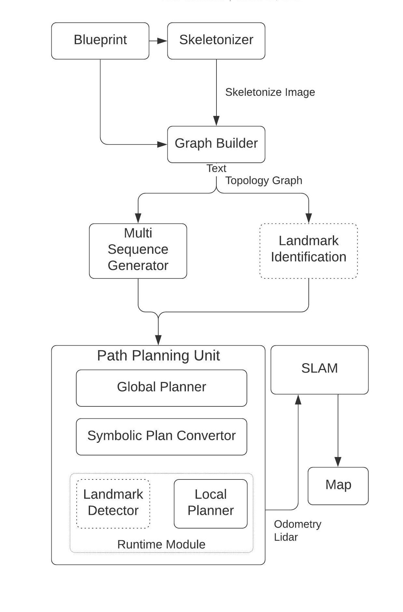

# auto_mapping_ros
Auto Mapping ROS software for autonomously constructing a High Definition Map using Multiple Robots.

This application provides the user with the ability to autonomously navigate a blueprint/floorplans and cover the entire free space to build a high definition map using any 2D/3D SLAM Software using multiple autonomous robots (F110 Cars).

Note: This package only provides control commands for the car to navigate in an indoor space. The user needs to provide localization to enable the car to localize in the blueprint (and thus to continue running the motion planner) and mapping software (optional: This is only required if the user wants to build their map). The simulator will still run without the localization package.

Useful external packages:

Localization: [Python 3 version of mit-racecar/particle_filter](https://github.com/shineyruan/particle_filter)
SLAM: [Google cartographer](https://google-cartographer.readthedocs.io/en/latest/)

# Build, Installation, and Run
**This package is no longer standalone software.** To run, please checkout [the CAD2CAV project.](https://github.com/mlab-upenn/ISP2021-cad2cav)
